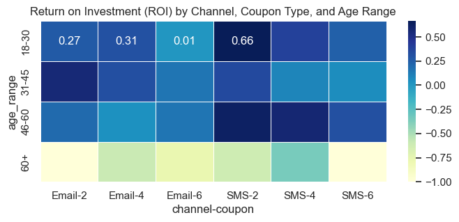

# Marketing Budget Allocation – Where should the next dollar go?

300,000 campaign sends, two channels, three coupon values, four age groups. Measured ROI by cell, then split a $60K quarterly budget where the return actually was — and dropped the segment that lost money on every send.



[Notebook](notebooks/mkt_budget_allocation.ipynb)

## Context

A marketing team has a fixed budget for next quarter's online campaigns and last quarter's send-level log. Which channel × coupon × audience combinations earned their cost back, and how should the money be re-split? (Originally a data-analytics screening exercise.)

## Data

`data/Q2_mkt_data.csv` — 300,000 sends, April 2019: channel (SMS 163K / Email 136K), coupon value (2 / 4 / 6), estimated age and age band, and the furthest funnel step reached (received → clicked → saw review → added to cart → payment page → purchased), plus units and order value for purchases. Funnel outcome: 1,862 purchases (0.62%).

## Results

- **SMS to 18–30 with the $2 coupon is the best cell: ROI 0.66.** Email to 31–45 (0.5+) and SMS to 46–60 (0.5+) are the other winners.
- **60+ loses money in every channel and coupon combination** (ROI −0.4 to −1.0). Low engagement, same cost.
- **Bigger coupons don't buy proportionally more conversions** — the $6 coupon is the weakest cell for most audiences.
- **Proposed split of $60K:** SMS 62% / Email 38%; by audience 18–30 35%, 46–60 36%, 31–45 29%, 60+ 0%. Largest single lines: SMS 18–30 $2 (12.5%), SMS 46–60 $2 (11.7%), SMS 46–60 $4 (10.8%), Email 31–45 $2 (10.5%).

## Approach

1. Funnel flags per send (received / clicked / bounced / add-to-cart / purchased); cost assumptions per channel and coupon; profit = order value − production cost − marketing cost.
2. Aggregate to channel × age × coupon cells: click rate, conversion rate, CPC, CPA, ROI.
3. Score each cell with a feature-weighted index (weights from a linear regression of ROI on the funnel metrics), zero out negative-ROI cells, normalise, allocate the budget, cap per-audience pools.

**Caveat:** the allocation is a heuristic ranking, not a causal or diminishing-returns model. With historical spend by cell it should be replaced by a response curve per channel (e.g. a log or Hill saturation fit) and optimised under the budget constraint.

## Stack

Python · pandas · scikit-learn · seaborn

## Run it

```bash
pip install -r requirements.txt
jupyter lab notebooks/mkt_budget_allocation.ipynb
```

## Structure

```
MKT-Budget-Allocation/
├── notebooks/mkt_budget_allocation.ipynb
├── data/Q2_mkt_data.csv
├── assets/
└── requirements.txt
```
